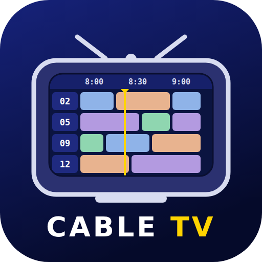

<p align="center"></p>

# Jellyfin Cable TV

Cable-style, always-on channels for Jellyfin, built from your own library.

The project has two parts:

- **The plugin (this repo)** is the brain. It holds the channels, content pools, scheduling, commercials and
  settings, and publishes the channels to Jellyfin Live TV with a guide and a continuous stream, so every Live TV
  client can watch them.
- **A [Wholphin fork](https://github.com/franticg33k/Wholphin) (`cable-tv` branch)** is the TV. It reads the plugin's schedule API and tunes in
  instantly by direct-playing the original file at the right offset, with preloading and a static overlay.

It's based on the feasibility study "Cable-TV Experience for Jellyfin — Plugin + Wholphin Fork Feasibility".
Inspired by NostalgiaTV, but written from scratch: none of its code or assets are used.

## Install

Requires **Jellyfin 12.x**.

**From your server's dashboard (recommended; you also get updates).**

1. **Dashboard → Plugins → Repositories → +**, name it *Cable TV*, and enter
   ```
   https://raw.githubusercontent.com/franticg33k/jellyfin-cable-tv/main/dist/manifest.json
   ```
2. **Dashboard → Plugins → Catalog**: *Cable TV* is under *Live TV*. Install it and restart Jellyfin.
3. New versions show up in the catalog and install the same way (or on their own when automatic plugin
   updates are on).

**By hand.** Download `cabletv_<version>.zip` from the
[latest release](https://github.com/franticg33k/jellyfin-cable-tv/releases/latest), stop Jellyfin, unzip it into
a new folder `<jellyfin config>/plugins/Cable TV_<version>/` (Docker: `/config/plugins/…`; Linux packages:
`/var/lib/jellyfin/plugins/…`; Windows: `%ProgramData%\Jellyfin\Server\plugins\…`) and start Jellyfin.

## Set up channels

Open **Cable TV** in the dashboard sidebar (under Plugins), or **Dashboard → Plugins → Cable TV**. The page is a form:

- **General**: the service name shown in guides and on the web TV page (default "Cable TV"), and the time zone
  that time slots, restricted hours, seasons and premieres use.
- **Live TV stream** and global **Commercials** sources.
- **Channels**: pick a channel on the left, edit it on the right. Sources use pickers for your libraries,
  collections and playlists, with genre suggestions.
- **Add channels**: *Suggest channels* proposes one channel per TV network, TV and movie genre, decade and
  collection, plus kids and holiday channels, counted from your library. *Quick channel* makes a channel from one
  genre, network, collection, playlist, library, year range, tag, rating, title keyword or list of titles.
- **Preview** shows what the selected channel would air over the next 6 hours using the unsaved settings.
- **Save** rebuilds the channels and refreshes the Live TV guide. The channels then appear under **Live TV**.
- **Advanced** holds the same settings as JSON, plus the ids on your server.

### Channel types

- **Standard**: scheduled from content sources (everything below).
- **Stream**: plays a stream URL (HLS `.m3u8` or any HTTP stream ffmpeg reads), for example a news feed or a webcam.
  Live TV clients get the URL as the channel's source; the guide shows it as one long live programme.
- **Weather**: a local forecast for a place name or `lat,lon`, in °F/mph or °C/km/h, from
  [Open-Meteo](https://open-meteo.com/) (no key needed; fetched at most every 15 minutes). Live TV clients see a
  forecast card rendered by the server; the Wholphin fork draws its own animated forecast.
- **Music** channels are standard channels with the `Audio` item kind: songs from genres, artists (`Artist` source),
  albums, playlists or libraries. Live TV streams show the cover art; the guide folds songs into half-hour blocks.
- **Trailers**: the `Trailers` source takes the trailers of the library's movies (local trailer files and trailer
  extras), optionally limited by genre in `Values`. Each slot carries the movie it belongs to, so clients can offer
  to tune to the channel airing it. *Suggest channels* proposes a "Coming Attractions" channel and one "Radio" channel
  per music genre.

### Content groups

**Content groups** are named, reusable source lists (for example "Saturday Morning" = a few collections plus a
genre). A channel uses one with a `Group` source whose `Values` are group names; groups can include other groups.
Changing a group changes every channel that uses it.

### Web TV

**Open web TV** on the settings page (or `/CableTv/Web` on your server) is a browser TV: sign in with your Jellyfin
account, then channel up/down, number keys, a guide (G) and full screen (F). It plays the channels' Live TV streams
with [hls.js](https://github.com/video-dev/hls.js), served by the plugin.

### Import and export

**Import and export** on the same page reads three kinds of file. *Check* reports, for each channel, which titles
your library has; *Import* saves the result.

- **Lineup CSV**, one row per show or movie:

  ```csv
  Channel Number,Channel Name,Title,Release Year
  2,Toon Town,Dexter's Laboratory,1996
  2,Toon Town,"Ed, Edd n Eddy",1999
  ```

  Titles are matched by name, ignoring case, accents, punctuation, "&"/"and" and a leading "The". The year tells
  remakes apart; titles the library doesn't have simply don't air. *Merge* adds new channels and replaces the titles
  of channels with the same name, keeping their settings. *Replace* makes the file the whole lineup. *Seasonal* turns
  the file into a holiday lineup (name, dates, replace or mix) on the existing channels, which is how Christmas or
  Halloween lineups are imported.
- **Episodes CSV** (`Show Title,Episode Title`) pins holiday specials into a seasonal lineup on every channel that
  carries the show, or on the channel you pick.
- **Channel pack** (JSON, from *Export channels*): every setting. Libraries, collections, playlists and items are
  found by name on the importing server, so packs can be shared.

*Export lineup (CSV)* lists what each channel airs, so a lineup can be edited in a spreadsheet and imported back.

### Logos

Each channel's logo is, in order: its own **Logo** (an image URL, or `studio:Network Name`); the image at
`{Logo pack URL}/{channel_name}.png` when a logo pack URL is set (`Cartoon Network` → `cartoon_network.png`,
`HBO+` → `hbo_plus.png`); the logo Jellyfin has for a studio or TV network with the channel's name (install the
**Studio Images** plugin to download network logos); otherwise a generated logo with the channel's name. No
third-party logos ship with the plugin; a logo pack is any folder of PNGs your server can reach, for example a
GitHub repository of your own.

### Channel JSON

The JSON form of a channel, for reference:

```json
[
  {
    "Id": "ch-0412",
    "Number": "0412",
    "Name": "Sitcoms",
    "Enabled": true,
    "Sorting": "RoundRobin",
    "ItemTypes": ["Episode"],
    "Sources": [{ "Type": "Genre", "Ids": [], "Values": ["Comedy"], "Weight": 1 }],
    "CommercialsEnabled": true,
    "GridMinutes": 30,
    "MidBreak": "Halfway",
    "CommercialSources": []
  }
]
```

| Setting | Meaning |
|---|---|
| `Id` | Stable id. It seeds the schedule, so changing it reshuffles the channel. |
| `Kind` | `Standard` (default), `Stream` (with `StreamUrl`) or `Weather` (with `WeatherLocation`, `WeatherMetric`). |
| `Sources` | Union of sources. `Library`, `Collection`, `Playlist`, `Items` take `Ids`. In `Values`: `Genre`, `Studio` (TV networks), `Tag`, `Rating` take names; `Decade` start years (`"1990"`); `Years` years or ranges (`"1985-1994"`); `Keyword` words in the title; `Titles` show or movie titles, optionally `"Title (Year)"`; `Episodes` `"Show :: Episode title"`; `Artist` artist names; `Trailers` movie trailers (optional genres); `Group` content group names. `Exclude: true` removes a source's items from the channel. `Weight` (1–10) airs a source's items more often under `Random`. |
| `LogoUrl` | Image URL, `studio:Name`, or empty for automatic (see Logos). |
| `Category` | Guide group, for example `Kids`; returned by the API. |
| `Sorting` | `Random`, `Cyclic`, `RoundRobin` (one episode per series in turn), `Block` (`BlockSize` episodes per series), `Marathon` (whole series back to back, series order reshuffled each pass). |
| `CommercialsEnabled` | Plan breaks. Commercials come from `CommercialSources`, or the page's global *Commercial sources* when empty (for example a *Home videos* library of ads). |
| `GridMinutes` | Pad every programme to the grid (for example 30): a 22-minute episode gets 8 minutes of breaks, topped up with filler when no commercial fits. |
| `MidBreak` | `None`, `Halfway`, or `Chapter` (chapter marker nearest halfway). |
| `BreakSeconds` | Break length when `GridMinutes` is 0. |
| `TimeSlots` | Different content at set times: `Name`, `Start`/`End` (`"07:00"`; an end at or before the start runs past midnight), `Days` (`["Sat","Sun"]`, empty = daily), `Sorting`, `Sources`. Programmes are fitted so a slot starts on time. |
| `AirHours` (on a source) | Restricted hours, e.g. `"21:00-05:00"`: that source's items only air then. |
| `Seasons` | Seasonal or holiday lineups: `Name`, `From`/`To` (`"12-01"`, inclusive, may wrap the new year), `Mode` (`Mix` or `Replace`), `Sources`. |
| `Premieres` | `Enabled`, `Time` (`"20:00"`), `Days`, `WithinDays`: items added in the last N days air at that time, marked new in the guide. |

**Live TV stream** settings on the same page:

- *Auto* (default) copies video from items in the channel's main codec and resolution and transcodes the rest.
- *Copy* never transcodes video. *Transcode* always makes H.264 at the chosen height.
- Audio is always converted to AAC stereo, optionally with loudness levelling.
- The **Prepare Cable TV commercials** scheduled task converts commercials once to each channel's stream format, so
  breaks are copied instead of transcoded. Until it has run, Auto mode transcodes mismatched ads on the fly.

## How watching works

- **Any Live TV app** (Jellyfin web, Android TV, Fladder, Wholphin, Swiftfin…): tuning in joins the programme
  that's airing at the right point and plays on through breaks and following programmes. Each channel runs one
  ffmpeg process, shared by everyone watching it, and it stops ~20 s after the last viewer leaves.
- **Clients using the [API](docs/api-contract.md)** (the Wholphin fork) get the full slot list and direct-play
  the original files instead, with no server transcoding.

## Status

| Phase | Scope | State |
|---|---|---|
| 0. Foundations | Plugin scaffold for Jellyfin 12.x, local test server | Done |
| 1. Plugin MVP | Channels, pools, random/cyclic schedule, `Schedule`/`Now` API, Live TV registration | Done |
| 2. Fork MVP | Guide, direct play at offset, preloading, static overlay | Done in the [Wholphin fork](https://github.com/franticg33k/Wholphin) (`cable-tv` branch) |
| 3. Fallback stream | Continuous copy-video / AAC-audio stream, shared per channel, timestamps that never rewind | Done |
| 4. Commercials | Break planning, halfway and chapter mid-breaks, fill-to-grid, one guide entry per programme | Done (commercials pre-converted by a scheduled task) |
| 5. Scheduling depth | Sorting modes, weights, time slots, restricted hours, seasonal lineups, premieres, settings form, preview | Done |
| 5b. Lineups | Suggestions, quick channels, CSV/JSON import and export, title/network/tag/rating/year/keyword sources, logos | Done (0.4.x) |
| 6. Presentation | Service name, weather channels, guide and overlay themes, theme editor and interface sounds (fork) | Done (0.5.0.0) |
| 7. Extras | Trailer pools, music channels, content groups, stream channels, web TV mode | Done (0.5.0.0) |

Known limits:

- In copy mode, tuning in mid-programme starts at the keyframe before the scheduled point (usually 1–5 s early).
- Jellyfin waits for a few HLS segments before playback starts, so tune-in takes a few seconds to ~20 s
  depending on the source's keyframe spacing.
- A rebuild that finds new or removed content reshuffles that channel.
- Weather needs the server to reach `api.open-meteo.com`; without it weather channels show "Forecast unavailable".
- Stream channels depend on the remote stream; Jellyfin's own clients may transcode them.
- Jellyfin doesn't show channel categories in its own guide yet; they're available to API clients.
- With time slots or seasons, an ordered lineup's position is estimated from airtime, so an episode can
  occasionally be skipped or repeated when a slot starts.

## Build

Needs the .NET 10 SDK.

```sh
dotnet build
dotnet test
python3 scripts/package.py            # writes dist/cabletv_<version>.zip and dist/manifest.json
```

To release, bump `version` (and the changelog) in `build.yaml` and merge to `main`. The *Publish* workflow then
tests, uploads the zip to a `v<version>` GitHub release and adds the version to `dist/manifest.json`, the plugin
repository servers read. It can also be run from the Actions tab; a version that's already released is skipped.

## Layout

```
src/Jellyfin.Plugin.CableTv/
  Scheduling/     Deterministic timeline engine: sorting, weights, blocks and breaks
  Library/        Library index and title matching
  Content/        Pool resolution, channel store, guide refresh
  Packs/          CSV and JSON import/export, channel suggestions
  Logos/          Channel logos (network images, logo packs, generated)
  Streaming/      Continuous MPEG-TS stream: ffmpeg arguments, per-channel broadcaster, commercial cache
  Weather/        Open-Meteo forecasts and the forecast card
  LiveTv/         ILiveTvService: channels, guide, stream source
  Api/            /CableTv REST API (the client contract)
  Web/            Browser TV page and hls.js
  Tasks/          "Rebuild Cable TV channels" and "Prepare Cable TV commercials" tasks
  Configuration/  Settings model and dashboard page
tests/            xUnit tests
docs/             API contract
scripts/          Packaging
dist/             Plugin repository manifest (zips are attached to GitHub releases)
images/           Catalog image and logo (PNG, with SVG sources)
dev/              Local Jellyfin 12 test server
```

## Credits

Generated logos use the [Oswald](https://fonts.google.com/specimen/Oswald) font, embedded under the SIL Open Font
License (`src/Jellyfin.Plugin.CableTv/Logos/Oswald-OFL.txt`). The web TV page bundles
[hls.js](https://github.com/video-dev/hls.js) (Apache License 2.0, `src/Jellyfin.Plugin.CableTv/Web/hls.js-LICENSE.txt`).
Weather data by [Open-Meteo](https://open-meteo.com/) (CC BY 4.0).
